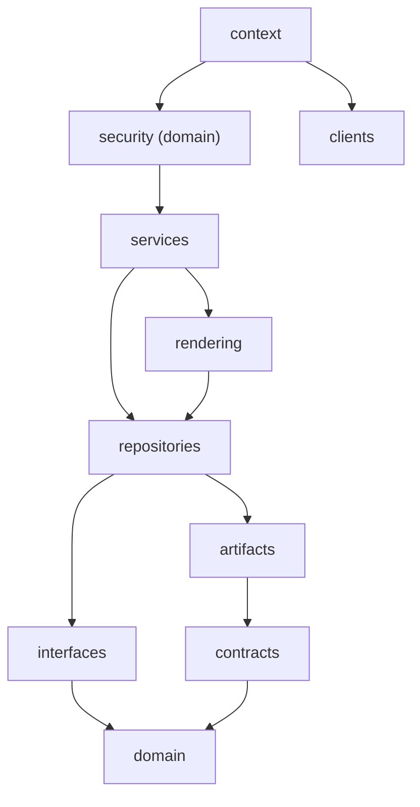
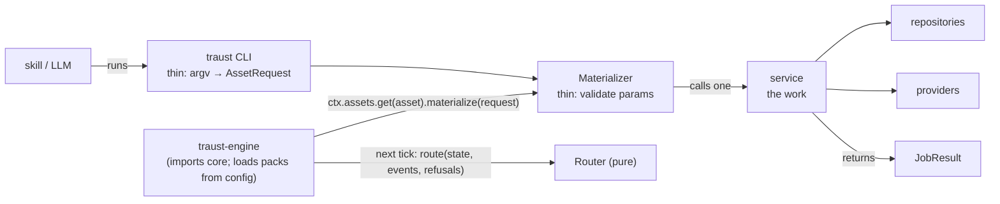
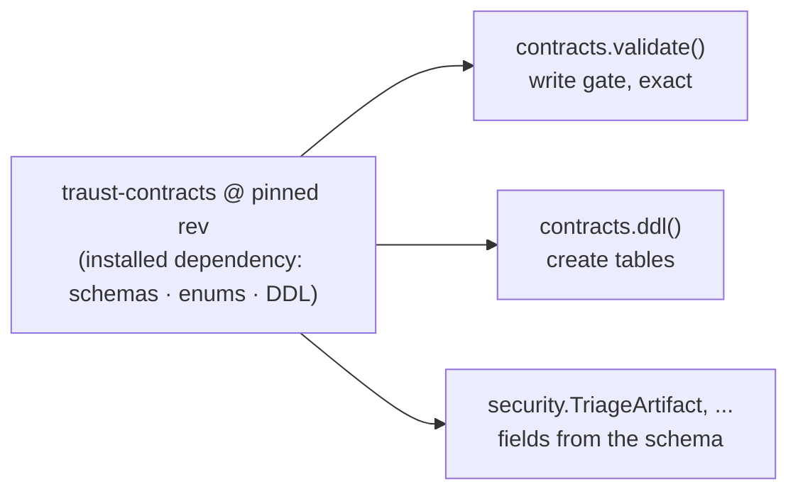

# traust-core

The shared Python base for traust: one clear place to read and write each kind of data, so scripts stop opening their own database connections, building their own paths, writing their own JSON and running their own subprocesses. It is an in-process library for traust (the harness), traust-engine and traust-ledger. No HTTP; an SDK comes later, when needed.

All modules live under `traust_core.v1` (see [Versioning](#versioning)).

| API | Module | Use it for | Instead of |
|---|---|---|---|
| **Contracts** | `contracts` | the pinned traust-contracts dependency, read as data: `validate(name, doc)` (exact JSON Schema gate), `schema()`, `enum_values()`, `normalize_enum(name, value)` (registry read view), `ddl()`, `storage_profile()` | skills remembering to run `reporting validate` |
| **Artifacts** | `artifacts` | the `Artifact` base + `SchemaView`: schema-validated bytes, fields from the installed schema (`doc.findings[0].verdict`), unknown names raise | `json.load` + `.get("key")` |
| **Security domain** | `security` | what the product's data means: named artifacts (`TriageArtifact`, …, `Verdict`, `Severity`), aggregate repositories (`TriageVerdictRepository`), domain services (`record_triage`) | each script re-deriving findings and verdicts |
| **Domain** | `domain` | `Model`/`Dto` bases, value objects (`HttpsRepoUrl`, `GitSha`, `CveId`), errors, `Clock`, storage identity (`binding_id`) | private helpers |
| **Artifact publishing** | `services.artifact_publishing` | `ctx.artifact_publisher(specs).publish(name, subject, raw, run_id)` (LLM) or `.publish_artifact(artifact, subject, run_id)` (code): exact gate → files (always) → index (when `database.url` is set) | writing `analysis-results` files by hand |
| **Analysis results** | `repositories.analysis_results` | `ctx.analysis_results().read(TriageArtifact, subject)` / `.read_all(TriageArtifact, tree)`; raw `put/get/find(subject, kind)`; today's naming convention in one place | `json.load` + `"-security-audit.json"` path building |
| **Storage records** | `repositories.storage`, `services.storage` | `record_artifact()` / `get_binding()` over contracts storage/v1 tables | contracts `Store.ingest/get_binding` |
| **Records (pattern)** | `repositories.sql` | `SqlUnitOfWork` + one `SqlRepository` per aggregate on SQLAlchemy Core; sqlite or Postgres by URL | `sqlite3.connect`, inline SQL |
| **Object store** | `repositories.object_store` | `ObjectStore.put/get/list` raw bytes by key, digest-verified (local dir; S3 later) | `write_text`, `json.dump` |
| **Rendering** | `rendering` | `Report` → `MarkdownRenderer` → `publish()`; `markdown_table()` | 18 copies of `render_md` |
| **Jobs** | `domain.outcome`, `interfaces.assets` | `Materializer.materialize(AssetRequest) -> JobResult` (succeeded · degraded · refused · failed): the seam traust-engine calls | each CLI inventing its own exit codes |
| **Interfaces** | `interfaces` | `Router` (continuous-ops `route()`), `Provider` + registries for tools, sources, feeds | ad hoc `subprocess`/`git`/fetch code |
| **Process** | `clients` | `ProcessRunner`, the only subprocess path | 22 private `run` wrappers |
| **Config + Context** | `context` | one `traust.yaml`; `Context` builds everything | `os.environ`, scattered config files |

## Layers

Dependencies point inward only; `tests/v1/test_layering.py` fails the build on a violation.



## How work reaches a service



traust, traust-engine and traust-ledger import core and call services in-process. The CLI exists only so an LLM can enter the Python world. Worked example: `tests/v1/example/continuous_ops/`.

## Two setups, one API

| | Local user | SCI / team |
|---|---|---|
| Config | `artifacts.path` only | + `database.url` (Postgres), object store |
| `ArtifactPublisher.publish` | validate → files | validate → files → storage binding |

The database schema is created from the traust-contracts repo by whoever provisions the database; traust-core reads and writes rows and checks its tables with `schema_drift()`.

## Usage

```yaml
# traust.yaml (local user)
artifacts: { path: ./analysis-results }
```

```python
ctx = Context.from_file(Path("traust.yaml"))  # entry point only
publisher = ctx.artifact_publisher(SPECS)  # SPECS: the caller's PublishSpecs
publisher.publish("triage", subject, raw_bytes, run_id)  # LLM output
triage = ctx.analysis_results().read(TriageArtifact, subject)  # typed read
```

## Worked examples (copy these shapes)

All in [`tests/v1/example/`](tests/v1/example):

| File | Shows |
|---|---|
| `model.py`, `repository.py`, `services.py` | domain model, repository (SQL + in-memory), unit of work, service functions |
| `artifact_publishing.py` | a publish spec (`TRIAGE` over `TriageArtifact`) with a rendered markdown companion |
| `report.py` | read through a repository → pure `build_report` → render → publish |
| `router.py` | a pure router, table-tested |
| `provider.py` | a tool provider: request DTO, `check()`, `acquire()` with provenance |
| `continuous_ops/` | engine → materializer → service → repository → `JobResult`, then a pure router reads the stored state; the same service reached from a CLI |

The real (non-example) aggregate repository to copy is `src/traust_core/v1/security/triage.py`: `TriageVerdictRepository` + `record_triage`.

## Contracts

traust-contracts is a pinned dependency (`[tool.uv.sources]` git rev in `pyproject.toml`). traust-core reads its **data files** (schemas, enums, DDL, profiles) from the installed package and never imports its Python. Nothing is copied or generated.



| Task | How |
|---|---|
| Move to a new contracts version | change the `rev` in `pyproject.toml`, `uv sync`, `make test` |
| Try an unreleased contracts change | `uv add --editable ../traust-contracts` locally (don't commit) |
| Add a named artifact | one line in `security/artifacts.py`: `class XArtifact(Artifact, name=…, schema=…, kind=…)` |
| See an artifact's fields | `TriageArtifact.describe()` (field tree with types, required/optional); `TriageArtifact.schema_path()` |

### Registry reader review candidate

`contracts.normalize_enum(name, value)` reads replacement metadata from the
installed pinned contracts data through this module's existing resource loader.
The Python placement and affected-contract review remain pending; this callable
candidate does not activate ledger reads or writers.

```python
from traust_core.v1 import contracts

view = contracts.normalize_enum("source_type", "interactive")
for pair in view.pairs:
    print(pair.enum, pair.value)
```

Unlike the existing filename-stem APIs `enum_values("source-type")` and
`enum("source-type")`, the normalizer accepts the registry document's exact
`name`, such as `source_type`, matching the Go SDK. There is no separator,
case or Unicode folding. Unknown enum names raise `ConfigError`; unknown values
in a known enum retain their exact spelling, because readers are not validators.

The frozen `EnumNormalization` contains ordered `EnumValue` pairs and a
`dropped` flag. Declared rename/merge/split replacements retain their order.
Retired keys still resolve when absent from current values; a one-way drop keeps
the original pair with `dropped=True`. Results cannot poison the cached registry.
The currently pinned data declares no deprecations, so values read unchanged;
legacy effort strings are never inferred to be sizes. Free-text mapping and
cross-field policy remain outside this API.

Neutral acceptance cases are authored in contracts' test fixtures and retained
as test-only copies in Core and SDK, not packaged runtime definitions. They
exercise replacements without choosing production vocabulary or requiring a
sibling checkout. No dependency pin or historical payload changes are made.

## Three kinds of code

| Kind | Answers | Lives in | Rule |
|---|---|---|---|
| **Framework** | *how* to store, read, run, configure | `domain`, `contracts`, `artifacts`, `interfaces`, `repositories`, `rendering`, `services`, `clients`, `context` | never imports `security` |
| **Security domain** | *what* findings, verdicts, dispositions and fingerprints mean | `security` | builds on the framework; shared by traust, traust-engine and traust-ledger |
| **Pack policy** | *when / which*: routing rules, cadences, lanes, skills, CLIs | traust (`traust_pack_security`) | not in this repo |

All three layers in this repo are stable `v1` API (additive only). A concrete repository appears per **aggregate** when there is a domain question to answer; its methods are those questions (see `security/triage.py`).

## Rules

- Service functions never open connections, build paths, start processes or read env vars; they receive what they need.
- `Context` at entry points only.
- Data is parsed into a model once, at the edge. No bare `dict` across a function boundary.
- SQLAlchemy Core only: no ORM mapped classes, no generic CRUD base. Domain objects never know about the database.
- Unknown or unmeasured values are `None`, never `0`.
- Every repository, store and provider has contract tests.
- No imports from other traust repos. No HTTP.

## Not built yet

| Item | Where |
|---|---|
| Layout contract (path template + kinds) replacing today's hard-coded convention | traust-contracts, `repositories.analysis_results` |
| Fingerprint rules (shape fixed; raises until the D5 spec lands) | `domain.integrity` |
| First real providers (git, forges, feeds) | packages |
| S3 object store backend | `repositories.object_store` |
| CI + release | — |

## Versioning

`traust_core.v1` is the platform API. Within `v1`, changes are additive only. A breaking change goes into a new `traust_core.v2` package alongside `v1`; `v1` stays importable until its consumers move. `v2` may import `v1`; `v1` never imports `v2`.

## Development

```bash
make setup              # uv sync (installs the pinned traust-contracts)
make lint-fix
make test               # unit tests
make coverage           # + coverage (coverage-html for htmlcov/)

make db-up              # shared traust-postgres container (same as contracts and ledger)
make test-integration   # Postgres tests (marked `integration`)
make db-down
```
